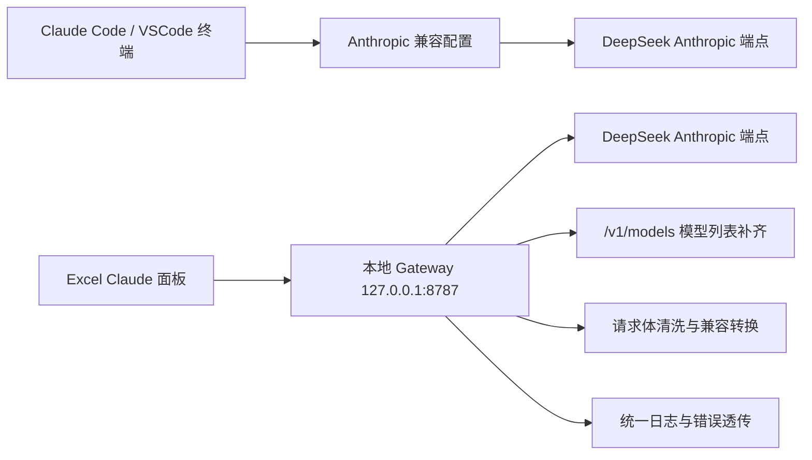

# Claude Code / Excel Claude + DeepSeek Windows 实战总结

更新时间：2026-05-08
适用环境：Windows 个人本机
目标读者：想在 Windows 上把 Claude Code、Excel Claude、DeepSeek API 串起来的人

## 0. 一句话结论

这套方案最终证明了三件事：

1. Claude Code 可以在 Windows 上稳定使用 DeepSeek API。
2. Excel 里的 Claude 面板可以通过一个本地 Gateway 直连 DeepSeek。
3. 只要把“模型名、请求格式、终端显示、环境变量、网关兼容层”这几个点处理好，就能做到“界面看起来还是 Claude，底层实际跑的是 DeepSeek”。

---

## 1. 我们最终做成了什么

### 1.1 Claude Code 侧

我们在 Windows 上把 Claude Code 配成了 DeepSeek 后端，核心思路是：

- 让 Claude Code 走 Anthropic 兼容接口
- 把 `ANTHROPIC_BASE_URL` 指向 DeepSeek 的 Anthropic 兼容端点
- 把模型默认路由到 `deepseek-v4-pro`
- 用独立的环境变量和启动方式，避免影响你现有的 Codex 工作流

### 1.2 Excel Claude 侧

我们为 Excel 的 Claude 面板加了一层本地 Gateway，原因是：

- Excel 会先探测 `GET /v1/models`
- 直接连 DeepSeek 的 Anthropic 端点时，这一步不一定满足 Excel 的预期
- Excel 还会发一些 Claude 风格但 DeepSeek 不完全接受的字段
- 本地 Gateway 可以补齐模型列表、清洗请求体、统一日志和错误返回

最终效果是：

- Excel 里显示仍然是 Claude 风格模型名
- 实际请求路由到 DeepSeek
- 你可以继续用熟悉的 Excel Claude 面板，而不是重新学习一套完全不同的界面

---

## 2. 总体架构



---

## 3. Claude Code 在 Windows 上的经验

### 3.1 推荐的配置方式

我们最终采用的是把 Claude Code 当作一个标准 CLI 工具来运行，只是把它的后端 API 改成 DeepSeek。

关键环境变量示例：

```powershell
[Environment]::SetEnvironmentVariable('ANTHROPIC_BASE_URL','https://api.deepseek.com/anthropic','User')
[Environment]::SetEnvironmentVariable('ANTHROPIC_AUTH_TOKEN','<DEEPSEEK_API_KEY>','User')
[Environment]::SetEnvironmentVariable('ANTHROPIC_MODEL','deepseek-v4-pro','User')
[Environment]::SetEnvironmentVariable('ANTHROPIC_DEFAULT_OPUS_MODEL','deepseek-v4-pro','User')
[Environment]::SetEnvironmentVariable('ANTHROPIC_DEFAULT_SONNET_MODEL','deepseek-v4-pro','User')
[Environment]::SetEnvironmentVariable('ANTHROPIC_DEFAULT_HAIKU_MODEL','deepseek-v4-flash','User')
```

### 3.2 为什么不要每次手动设置

如果你每次都在当前终端临时 `set`，就会出现：

- 关掉窗口后配置丢失
- VSCode 打开新终端时要重新设置
- 你会误以为“Claude 又坏了”

所以最好写成用户级环境变量，或者做成专门的启动脚本。

### 3.3 终端显示和乱码问题

我们遇到过的“像素宠物乱码”“界面残影”“CMD 里不能正常全屏”等问题，本质上大多不是模型问题，而是终端渲染问题。

常见原因：

- CMD 对 Unicode / ANSI 支持不稳定
- 字体不支持某些图形字符
- 终端窗口不支持 Claude Code 的动态 UI

更稳的做法：

- 用 VSCode 集成终端
- 或用支持更好的终端启动 Claude Code
- 确保 UTF-8 编码环境可用

### 3.4 和 Codex 是否互相影响

不会天然互相影响。

只要你把：

- Claude Code 的环境变量单独配置
- Excel Gateway 的 API Key 单独配置
- 不覆盖 Codex 自己的配置

这三件事分开，就能做到各跑各的。

---

## 4. Excel Claude 接入 DeepSeek 的经验

### 4.1 为什么不能只填 DeepSeek 官方地址

Excel Claude 的 Gateway 模式不仅会发聊天请求，还会先做接口探测，例如：

- `GET /v1/models`
- `POST /v1/messages`
- 有时还会带上 Claude 风格的复杂字段

而 DeepSeek 的 Anthropic 兼容端点虽然支持消息接口，但在“模型发现、请求结构容错、某些扩展字段”上，和 Excel 的预期并不总是一一对应。

所以我们最后不用“裸连”，而是加了一个本地 Gateway。

### 4.2 本地 Gateway 的职责

Gateway 负责三件事：

1. 补齐模型列表
   - Excel 想看见 Claude 风格的模型名
   - 例如 `claude-sonnet-4-6`、`claude-opus-4-1`
   - 但后端实际路由到 `deepseek-v4-pro`

2. 清洗请求体
   - 删除 DeepSeek 不支持的字段
   - 把 `tools.custom` 转成标准工具结构
   - 丢弃 `image/document/mcp_*` 等不兼容 block

3. 统一错误处理
   - 上游 400/500 不再“闷声失败”
   - 直接把 DeepSeek 的错误原文打出来，便于定位

### 4.3 最终的模型映射

我们使用的映射逻辑是：

- `claude-sonnet-4-6` -> `deepseek-v4-pro`
- `claude-opus-4-1` -> `deepseek-v4-pro`
- `claude-3-5-haiku-latest` -> `deepseek-v4-flash`

这样做的好处是：

- Excel 界面仍然是熟悉的 Claude 风格
- 你内部实际使用的是 DeepSeek
- 不需要每次在 UI 里重新理解“这是哪个真实模型”

---

## 5. Gateway 的工作原理

### 5.1 入口

Gateway 本地监听：

```text
http://127.0.0.1:8787
```

### 5.2 它提供的接口

- `GET /healthz`
- `GET /v1/models`
- `GET /models`
- `POST /v1/messages`

### 5.3 为什么要有 `/v1/models`

这是 Excel Claude 最关键的兼容点之一。

如果没有这个接口，Excel 会认为后端不完整，连接步骤就可能失败。

### 5.4 为什么要清洗请求体

因为 Excel 有时会发送这些内容：

- `context_management`
- `metadata`
- `tools.custom.input_examples`
- 某些不被 DeepSeek 支持的 content block

如果不做清洗，DeepSeek 可能直接 400。

### 5.5 我们已经验证过的清洗行为

Gateway 会：

- 保留 `text / thinking / tool_use / tool_result`
- 丢弃 `image / document / search_result / redacted_thinking / mcp_* / server_tool_use` 等块
- 只保留 `output_config.effort`
- 去掉 `tool_choice.disable_parallel_tool_use`
- 给 `max_tokens` 一个安全默认值

---

## 6. 启动和关闭方式

### 6.1 启动 Gateway

在 `D:\scrapling_study\gateway` 目录下执行：

```powershell
.\.venv\Scripts\python.exe -m uvicorn app.main:app --host 127.0.0.1 --port 8787 --log-level debug
```

### 6.2 常见问题

如果你遇到：

```text
.\venv\Scripts\python.exe : The term ... is not recognized
```

通常是因为目录名写错了。

正确的是：

- `.venv`

不是：

- `venv`

### 6.3 桌面脚本

我们还准备了桌面启动/关闭脚本：

- `C:\Users\Komi\Desktop\Start-Excel-DeepSeek-Gateway.bat`
- `C:\Users\Komi\Desktop\Stop-Excel-DeepSeek-Gateway.bat`

---

## 7. Excel 里的操作步骤

1. 打开 Excel
2. 打开 Claude 面板
3. 选择 `Connect another way`
4. 选择 `Gateway`
5. Gateway URL 填：

```text
http://127.0.0.1:8787
```

6. Token 填一个有效值
   - 如果你本地 `.env` 已有 Key，Gateway 会优先使用本地 Key
   - 不要把真实 Key 写进共享文档
7. 点击 `Continue`
8. 先发一个很短的测试请求，再逐步测试长文本和表格

---

## 8. 我们验证通过的结果

### 8.1 基础验证

- `GET /v1/models` 返回 200
- 模型列表可以正常显示 Claude 风格别名

### 8.2 消息验证

- `POST /v1/messages` 对最小请求可以返回 200
- 复杂请求在清洗后也可以正常通过
- 流式请求也可以正常返回 `text/event-stream`

### 8.3 日志验证

Gateway 日志会明确显示：

- 请求路径
- `origin`
- 是否带 `x-api-key`
- 请求体 keys
- messages 数量
- tools 数量
- 上游错误原文

并且从 `gateway v1.5.1` 开始：

- 日志会自动脱敏 `authorization/x-api-key/token/password/cookie` 等字段
- 请求体日志有大小上限，避免超大请求导致日志膨胀

这让排查速度快很多，也更安全。

---

## 9. 常见故障与排查顺序

### 9.1 连接失败 / 404

优先检查：

- 你是不是直连了 DeepSeek 而不是 Gateway
- 是否缺少 `/v1/models`
- URL 是否写成了 `https://api.deepseek.com/anthropic` 而不是 `http://127.0.0.1:8787`

### 9.2 400 Bad Request

优先检查：

- 是否有不兼容字段被发送到上游
- 是否出现 `image`、`document`、`mcp_*` 这类 block
- 是否工具结构里带了 DeepSeek 不支持的扩展字段

### 9.3 乱码 / 像素宠物显示异常

这通常是终端而不是 API：

- 换支持更好的终端
- 确认 UTF-8
- 检查字体
- 不要把这个问题误判成“模型接错了”

### 9.4 每次都要重新设置环境变量

说明你还没把变量做成：

- 用户级环境变量
- 或固定启动脚本

### 9.5 VSCode 里打不开 Claude Code

常见原因是：

- CLI 没装好
- PATH 没加载
- VSCode 新开终端没有继承环境变量

### 9.6 输出一段时间后中途停止 + JSON 解析报错

这是 2026-05-08 我们真实遇到过的一次高频问题，典型表现是：

- Office 端报超时（`The connection timed out. Please try again.`）
- 或前端报 JSON 解析错误（`Expected ',' or '}' after property value ...`）
- Gateway 日志出现重复重试、流中断、偶发 `502`

确认根因有两个：

1. 旧逻辑做了“探测请求 + 正式请求”的双请求流转发（probe + replay），链路变长且更容易抖动。
2. 旧版日志中间件实现方式会干扰 `StreamingResponse`，流式场景下可能触发上游连接提前关闭。

我们落地的修复：

1. `/v1/messages` 流式分支改为单次上游请求 + 原流转发（不再 probe/replay）。
2. 流式事件加了 `data:` JSON 校验，异常事件不再直接把坏片段传给前端，而是转成结构化 `event:error`。
3. 日志中间件改成 ASGI 兼容写法，避免破坏 streaming 生命周期。
4. 日志增强：敏感字段脱敏 + body 大小限制。

修复后的验证点：

- `GET /v1/models` 稳定 200
- `POST /v1/messages` 最小探测请求稳定 200
- 长上下文 + tools + stream 请求可持续返回 `text/event-stream`
- 本地 SSE 校验无坏 JSON 事件行

如果后续复发，优先收集这几条证据再排查：

1. 同时段 Gateway 日志（至少覆盖请求开始到报错后 1 分钟）
2. 是否出现 `[gateway malformed sse data]` 或 `[gateway stream error]`
3. 上游返回码分布（401/402/429/5xx）
4. 当前网关版本（建议 `v1.5.1` 及以上）

---

## 10. 为什么这套方案不影响 Codex

因为我们把它拆成了两条独立链路：

- Claude Code 走自己的 Anthropic 兼容配置
- Excel Claude 走本地 Gateway
- Codex 继续用自己的 API 配置，不被覆盖

最重要的原则是：

- 不共享同一个全局密钥变量
- 不把所有产品都绑到同一个入口
- 不在系统层面硬改你原有工作流

---

## 11. 安全建议

1. 不要复用已经暴露过的 Key
2. 为 Claude Code 和 Excel 分别准备 Key
3. 不要把 Key 写进公开文档
4. 定期轮换
5. 本地网关优先保持在 `127.0.0.1`
6. 共享文档只写流程，不写密钥

---

## 12. 推荐的最小可复制流程

### Claude Code 版

1. 安装 Claude Code CLI
2. 配好 `ANTHROPIC_BASE_URL` 和 `ANTHROPIC_AUTH_TOKEN`
3. 把默认模型路由到 `deepseek-v4-pro`
4. 用 VSCode 终端或更稳定的终端启动

### Excel 版

1. 启动本地 Gateway
2. Excel 里选 `Gateway`
3. URL 填 `http://127.0.0.1:8787`
4. 发一个短请求测试
5. 再测试长文本、表格、带工具的请求

---

## 13. 相关文件

- `D:\scrapling_study\CLAUDE_DEEPSEEK_WINDOWS_GUIDE.md`
- `D:\scrapling_study\docs\excel-claude-deepseek-gateway-sop.md`
- `D:\scrapling_study\gateway\app\main.py`
- `D:\scrapling_study\gateway\app\log_mw.py`
- `D:\scrapling_study\gateway\run-gateway.ps1`
- `D:\scrapling_study\gateway\start-gateway.bat`
- `D:\scrapling_study\gateway\stop-gateway.bat`

---

## 14. 最后一句话

这套经验的核心不是“换了一个模型名”，而是：

**把 Claude 的使用习惯保留下来，把 DeepSeek 放到你最舒服的工作流后面。**
