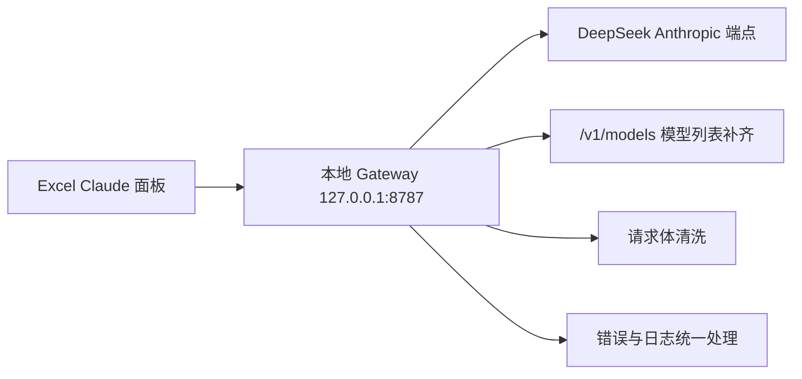

# Claude Code / Excel Claude + DeepSeek macOS 实战总结

更新时间：2026-05-09
适用环境：macOS 个人本机
目标读者：想在 Mac 上把 Excel Claude 与 DeepSeek API 串起来的人

## 0. 一句话结论

这套方案在 macOS 上可以稳定工作，关键是把兼容层、模型映射、环境变量和本地启动脚本一次性整理好。

## 1. 我们最终做成了什么

### 1.1 Excel Claude 侧

- Excel 仍然通过 `Gateway` 模式接入
- 本地网关监听 `http://127.0.0.1:8787`
- UI 中仍显示 Claude 风格模型名
- 实际请求被路由到 DeepSeek

### 1.2 Gateway 侧

本地 Gateway 负责三件事：

1. 提供 `GET /v1/models`，满足 Excel 的模型探测
2. 清洗 Claude 风格请求体，删除不兼容字段
3. 统一打印日志并透传上游错误

## 2. 总体架构



## 3. 为什么要本地 Gateway

Excel Claude 不只是发聊天请求，还会先探测模型列表，并可能发送一些 DeepSeek 不完全接受的字段。直接裸连 DeepSeek Anthropic 兼容端点时，这些地方会成为失败点。

本地 Gateway 的价值在于：

- 对外提供 Excel 预期的接口形状
- 对内把请求转换成 DeepSeek 更容易接受的结构
- 出错时把错误暴露得更明确

## 4. 模型映射

当前默认映射：

- `claude-sonnet-4-6` -> `deepseek-v4-pro`
- `claude-opus-4-1` -> `deepseek-v4-pro`
- `claude-3-5-haiku-latest` -> `deepseek-v4-flash`

好处是 Excel UI 维持 Claude 风格，而后端仍然可以使用 DeepSeek。

## 5. macOS 下的启动方式

首次运行：

```bash
cd gateway
cp .env.example .env
chmod +x ./*.sh
./run-gateway.sh
```

后台运行：

```bash
./start-gateway.sh
./stop-gateway.sh
```

说明：

- `run-gateway.sh` 会自动创建 `.venv`
- 脚本优先使用 `python3`，找不到时回退到 `python`
- `.env` 会在启动时自动导入
- 后台模式日志写入 `gateway.log`

## 6. 验证方法

启动后执行：

```bash
curl http://127.0.0.1:8787/healthz
curl http://127.0.0.1:8787/v1/models
```

如果两个接口都正常，再去 Excel Claude 面板里完成 Gateway 连接。

## 7. 实战建议

- 优先把真实 DeepSeek Key 写入 `.env`，这样 Excel 中只需要填任意非空 Token
- 如果不想把 Key 落盘，也可以把真实 Key 直接填在 Excel 的 Token 中
- 不要把 `.env`、`.venv`、`gateway.log`、`.gateway.pid` 提交到仓库
- 保持网关只监听本机回环地址，减少泄露风险
